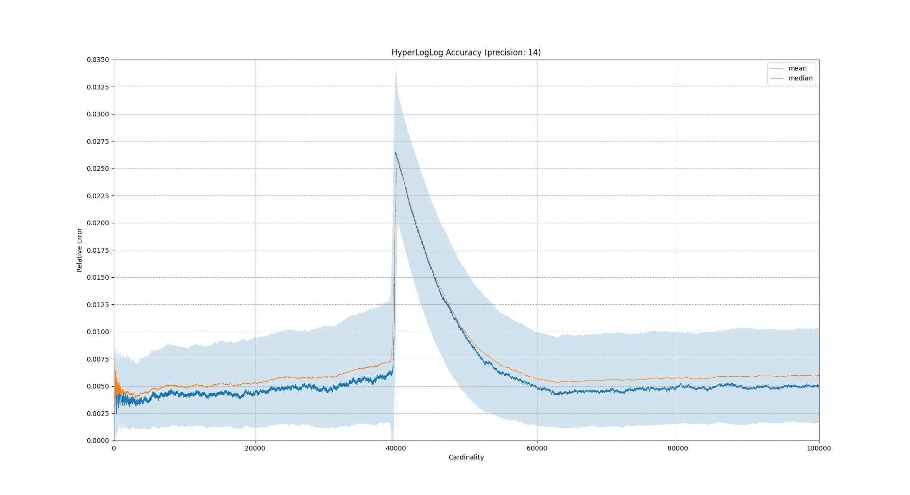
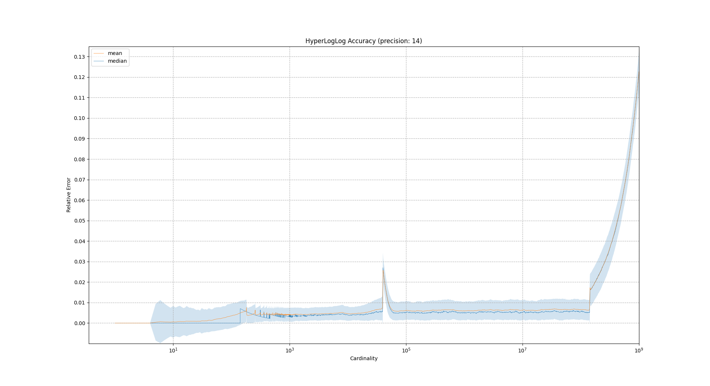
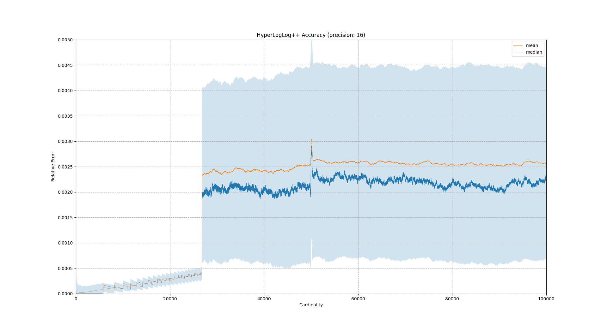
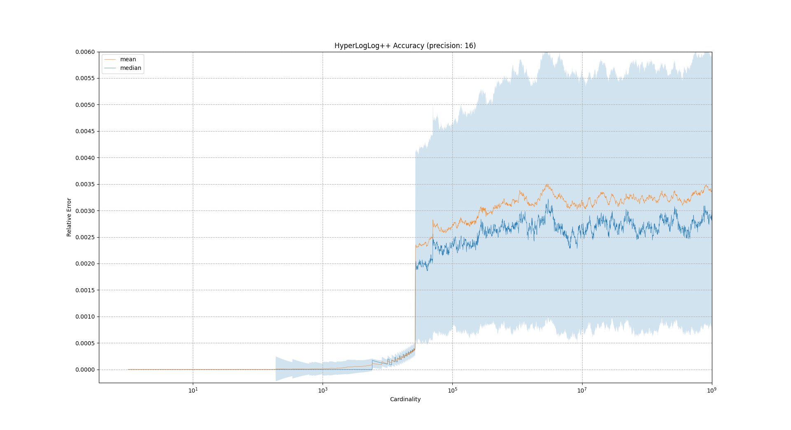

# Experimental Evaluation

In order to verify the accuracy of the HyperLogLog implementations we performed
two experiments. 

In the first experiment we generated 500 files containing 1e5 randomly generated
numbers each. The numbers were added to the sketch and the cardinality was
estimated with each addition. The relative error is displayed in figures 
[1](#hyperloglog-figure-0), [3](#hyperloglogplus-figure-0).

In the second experiment we added 1e9 randomly generated numbers to the sketch.
We measured cardinality estimations at predefined (actual) cardinalities which
followed a geometric series with ratio 1.007. The relative error for 500 runs
is displayed in figures
[2](#hyperloglog-figure-1), [4](#hyperloglogplus-figure-1).

HyperLogLog++ displays lower relative error compared to HyperLogLog in small
cardinalities because the sparse representation of the sketch is used which
allows us to perform estimations with much higher precision.

## HyperLogLog

## HyperLogLog++

